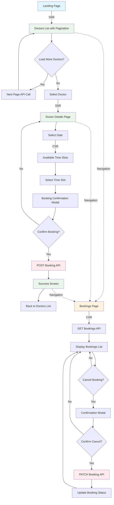

# Doctor Booking Application

A modern doctor booking application built with Next.js and a component library workspace, featuring hybrid SSR/CSR architecture for optimal performance and SEO.

## Application Flow Chart

