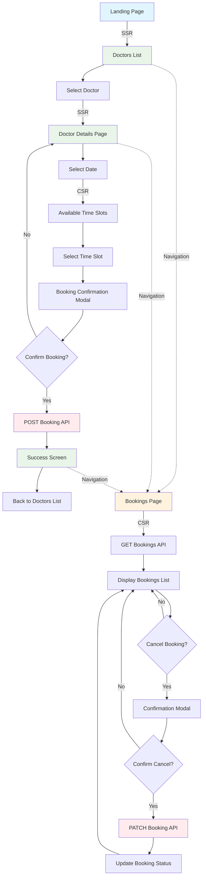

# Doctor Booking Application

A modern doctor booking application built with Next.js, TypeScript, and a custom component library (`necktie-ui`). The project demonstrates a hybrid SSR/CSR architecture for optimal performance, SEO, and mobile-first UX. Internationalization (English/Traditional Chinese) and accessibility are core priorities.

**Live Demo:** [https://doctor-booking-necktie.vercel.app](https://doctor-booking-necktie.vercel.app/)

---

## Table of Contents

- [Features](#features)
- [Architecture](#architecture)
- [Monorepo Structure](#monorepo-structure)
- [Design System](#design-system)
- [Internationalization](#internationalization)
- [Getting Started](#getting-started)
- [Development Workflow](#development-workflow)
- [Contributing](#contributing)
- [Application Flow Chart](#application-flow-chart)
- [Q&A: Technical and Architectural Decisions](#qa-technical-and-architectural-decisions)

---

## Features

- **SSR/CSR Hybrid:** SEO-optimized doctor listing/details (SSR), interactive booking flow (CSR)
- **Component Library:** Reusable, mobile-first UI components with Storybook docs
- **Internationalization:** English & Traditional Chinese, locale-aware routing
- **Mobile-First:** Responsive layouts, touch-friendly controls, micro-animations
- **Monorepo:** pnpm workspace, turbo build, strict linting, commit hooks

---

## Architecture

- **SSR Pages:** `/` (Doctors List), `/doctors/[id]` (Doctor Details)
- **CSR Pages:** `/bookings` (My Bookings), `/doctors/[id]/book` (Booking Flow), `/booking/success` (Confirmation)
- **Component Library:** [`packages/necktie-ui`](packages/necktie-ui)
- **API Layer:** [`apps/doctor-booking/src/lib/api`](apps/doctor-booking/src/lib/api)
- **i18n:** [`apps/doctor-booking/public/locales`](apps/doctor-booking/public/locales)

---

## Monorepo Structure

```
/
├── apps/doctor-booking/      # Next.js app
│   ├── src/app/              # App Router pages
│   ├── src/components/       # Business logic components
│   ├── src/lib/              # API clients, hooks, types
│   ├── public/locales/       # i18n translations
│   ├── styles/               # SCSS modules
├── packages/necktie-ui/      # Component library
│   ├── src/components/       # UI components
│   ├── stories/              # Storybook stories
│   ├── styles/               # SCSS modules
├── .github/workflows/        # CI/CD pipelines
├── .husky/                   # Git hooks
├── pnpm-workspace.yaml       # Workspace config
├── turbo.json                # Build optimization
├── package.json              # Root scripts
└── README.md                 # This documentation
```

---

## Design System

- **Brand Colors:** #ff0068 (Pink), #fff0f6 (Light Pink), rgb(42,46,66) (Dark Blue), rgb(104,113,136) (Medium Blue)
- **Component Library:** Buttons, Cards, Modals, Calendar, Skeletons, Layout

---

## Internationalization

- **Languages:** English (`en`), Traditional Chinese (`zh-HK`)
- **Locale-aware:** Date/time formatting, cultural color choices, responsive text sizing
- **Implementation:** [react-i18next](https://react.i18next.com/), Next.js i18n routing

---

## Getting Started

```sh
# Install dependencies
pnpm install

# Copy and configure environment variables
cp apps/doctor-booking/.env.example apps/doctor-booking/.env.local
# Set API_BASE_URL and API_KEY in .env.local

# Start development server
pnpm dev
```

- App runs at [http://localhost:3000](http://localhost:3000)

```sh
# Storybook for UI library:
pnpm storybook --filter=necktie-ui
```

### Build & Test

```sh
pnpm build        # Build all packages/apps
pnpm lint         # Run lint checks
pnpm format:check # Check code formatting
```

---

## Development Workflow

- **Monorepo:** Managed via pnpm workspaces
- **Turbo:** Fast, parallel builds and caching
- **Linting:** ESLint, Prettier, commit hooks via Husky
- **CI/CD:** GitHub Actions for PR checks, Vercel deployment
- **Commit Convention:** Conventional commits enforced via Commitlint

---

## Contributing

See [CONTRIBUTING.md](CONTRIBUTING.md) for guidelines.

---

## Application Flow Chart



---

## Q&A: Technical and Architectural Decisions

### 1. Choice of Package

**Please specify the key packages you use (except for React) and explain why you chose each package.**

For each package:
- **Purpose/Importance**
- **Benefits & Drawbacks**
- **Assumptions**

#### pnpm (Monorepo)
- **Purpose:** Fast, disk-efficient package manager; workspace support for monorepo.
- **Benefits:** Atomic installs, deduplication, workspace linking, fast CI.
- **Drawbacks:** Less familiar to some teams vs npm/yarn.
- **Assumptions:** All packages/apps benefit from shared dependencies and atomic installs. This monorepo architecture was chosen to segregate the necktie-ui project and the actual doctor-booking app. However, I could have developed the standalone applications, but as part of the assignment, I have to submit one solution.

#### turbo
- **Purpose:** Monorepo build orchestration, caching, parallel tasks.
- **Benefits:** As I went ahead with the pnpm, the turbo provides Fast builds, incremental caching and easy pipeline config.
- **Assumptions:** Multiple packages/apps need coordinated builds/tests.

#### sass
- **Purpose:** SCSS for modular, maintainable, mobile-first styling.
- **Benefits:** Variables, mixins, nesting, easy theming.

#### i18next / react-i18next
- **Purpose:** Internationalization, translation management.
- **Benefits:** Locale routing, dynamic loading and context-aware translations.
- **Assumptions:** App will be used in the Hong Kong market, where major languages are English and Chinese.

#### eslint
- **Purpose:** Static code analysis, enforce code standards.
- **Benefits:** Prevents bugs, enforces style, integrates with CI.

#### prettier
- **Purpose:** Automated code formatting.
- **Benefits:** Consistent style, fast formatting, integrates with editors/CI.

#### husky
- **Purpose:** Git hooks for pre-commit/pre-push checks.
- **Benefits:** Prevents bad commits, enforces lint/tests before push.

---

### 2. Potential Improvements

**If given more time, what improvements would you implement?**

#### Frontend
- Enhance My Bookings page: filters, sorting, richer UI.
- Add confirmation modal for booking cancellation.
- Improve loading skeletons and micro-animations for smoother UX.
- Cache GET bookings API call to prevent data-fetching on each page-load.

#### Accessibility
- Add ARIA accessibility.
- Support keyboard navigation.

#### Monitoring
- Add error tracking and monitoring. (e.g, Sentry and RUM)
- Add accessibility audits and automated checks.

#### Testing
- Add unit tests.
- Add more integration/e2e tests for booking flows.

#### Maintainability
- Refine code formatting: separate rules for TypeScript and SCSS.
- Properly configure css variable and styles and increase reusability.

#### API improvement
- booking response should include doctor name, not just doctorId, to avoid extra API calls.
- Implement API pagination for doctors/bookings.

---

### 3. Production Considerations

**What extra steps should be taken with caution when deploying your app to a production environment?**

- **API Secrets:** Ensure `API_BASE_URL` and `API_KEY` are set securely in production environment variables.
- **Environment Separation:** Use `.env.production` for prod secrets, never commit secrets.

---

### 4. Assumptions

**a. Any assumptions you have made when you designed the data model and API schema?**
**b. Any other assumptions and opinions you have taken throughout the assessments?**

#### Data Model & API Schema
- API is running in HK timezone.
- API does not support pagination or localization by default.
- Booking API returns only doctorId, not doctor name.
- Time format: `9.5` means `9:50` (not `9:30`).

#### Other Assumptions
- All users are authenticated implicitly (no login flow in assignment).
- API endpoints are stable and available.
- Mobile-first usage is the primary scenario.
- English and Traditional Chinese are the only required locales.
- All doctors are available for booking unless marked closed.
